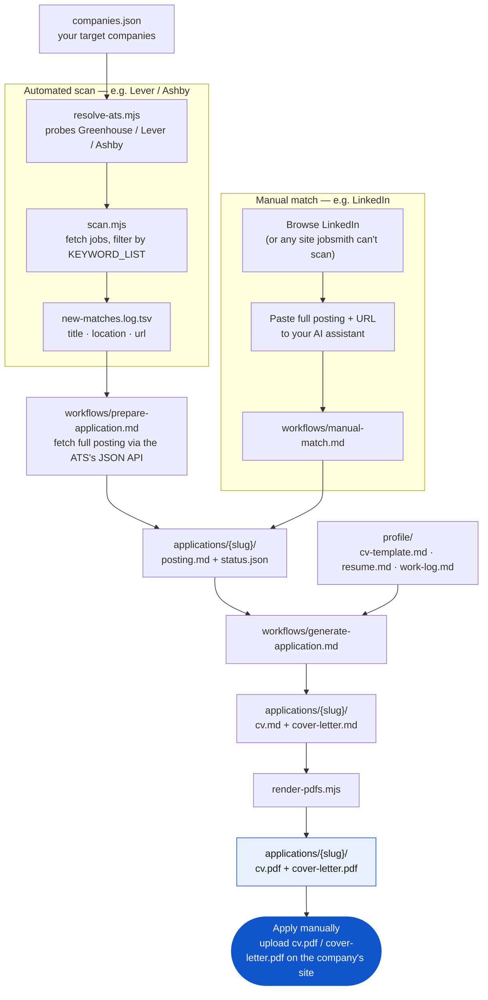

# jobsmith

End-to-end pipeline from "find a role" to "here's a tailored CV and cover
letter, ready to send" — scanning is near-$0, CV/CL generation is grounded
in your real work history, and applying stays a manual, human-in-the-loop
step on purpose. No LinkedIn/Indeed scraping (ToS risk to your account).

Works for any engineer — backend, frontend, mobile, DevOps, junior or
senior. Nothing in here is tied to a particular stack; you edit a plain
keyword list and your own profile to point it at your own search.

## How it works

Two ways a job enters the pipeline — an automated scan (Greenhouse/Lever/
Ashby/custom-ATS/HN Jobs) or a manual paste from a site jobsmith can't scan
(LinkedIn, Indeed, anything behind a login) — and both converge on the same
CV/cover-letter generation step, ending in PDFs you review and submit
yourself:



`cv.pdf` and `cover-letter.pdf` in each `applications/{slug}/` folder are
the final output — real text-layer PDFs, ATS-friendly, ready to attach or
paste into the company's own application form. jobsmith stops there on
purpose; see [What this deliberately doesn't do](#what-this-deliberately-doesnt-do-yet).

## Getting started

1. **Clone and install:**
   ```bash
   git clone <this-repo-url> jobsmith
   cd jobsmith
   npm install
   cp .env.example .env
   ```
   `.env` only needs `FIRECRAWL_API_KEY` — a free key (no card) from
   [firecrawl.dev](https://firecrawl.dev). It's optional at first: only
   required for companies with a custom-ATS career page
   (`scan-custom.mjs`), and it improves accuracy on Hacker News Jobs'
   often role-less titles (`scan-hn-jobs.mjs`). Everything else works
   without it.

2. **Add a few target companies** to `companies.json` — just `name` +
   `domain`. If a company turns out to run a custom ATS (see [The
   companies that won't resolve](#the-companies-that-wont-resolve--firecrawl)
   below), add a `careerPageUrl` too. Ships with two example entries —
   replace them with your own targets.

3. **Describe your own search** in `keywords.mjs` — edit the
   `KEYWORD_LIST` array with plain words/phrases, no regex needed:
   ```js
   export const KEYWORD_LIST = [
     'software engineer',
     'backend',
     'devops',
   ];
   ```
   See [Tuning matches](#tuning-matches) for details.

4. **Set up `profile/`** — this is what CV/cover-letter generation reads
   from. Copy the three example files to their real (gitignored) names and
   fill them in:
   ```bash
   cp profile/cv-template.example.md profile/cv-template.md
   cp profile/resume.example.md profile/resume.md
   cp profile/work-log.example.md profile/work-log.md
   ```
   This is the part most likely to feel like a blank page, so some
   concrete starting points:
   - **`resume.md` / `cv-template.md`**: paste your existing resume/CV
     text (export it from Google Docs, Word, or LinkedIn as plain text)
     to your AI assistant and ask it to reformat into each file following
     the structure already shown in the `.example.md` versions.
   - **`work-log.md`**: the highest-leverage one to get AI help with —
     ask your AI coding assistant to go through your git log / commit
     history across your recent repos (`git log --author=you --stat`, or
     just point it at a repo) and summarize notable technical work into
     Sections 2 and 3 (theme index + detailed log with quotes). **Section
     1 (voice/tone) is worth writing or editing by hand** — it's about
     sounding like *you*, which an AI can't reliably infer from commits
     alone.

   Full details in `profile/README.md`.

5. **Verify your setup end-to-end:**
   ```bash
   node resolve-ats.mjs   # should print at least one ✅
   node scan.mjs          # first run reports everything as "new" — that's the baseline
   ```
   Then run one match through `workflows/prepare-application.md` →
   `workflows/generate-application.md` → `node render-pdfs.mjs {slug}` and
   confirm `applications/{slug}/cv.pdf` and `cover-letter.pdf` come out.
   If all of that works, your pipeline is wired correctly.

## Using this with your AI tool

Everything under `workflows/` is a plain, tool-agnostic markdown procedure
— written to be followed by any AI coding assistant that can read/write
files in this repo and run shell commands. `.claude/skills/` wraps each
one so Claude Code auto-invokes it; for OpenCode, Cursor, Aider, or
anything else, either point your assistant at the relevant
`workflows/*.md` file directly ("read and follow
workflows/generate-application.md exactly"), or wire up an equivalent
custom-command/skill mechanism if your tool has one. No workflow content
changes based on which tool you use.

## Your journey, step by step

1. **Discover a role.**
   - Companies you're tracking (`companies.json`) get scanned automatically
     — Greenhouse/Lever/Ashby via free public APIs (`scan.mjs`), custom-ATS
     career pages via Firecrawl's free tier (`scan-custom.mjs`). New matches
     land in `new-matches.log.tsv`. See [How scanning
     works](#how-scanning-works).
   - Hacker News' Jobs feed (YC-company postings) gets scanned the same way
     — `node scan-hn-jobs.mjs`. See [Hacker News
     Jobs](#hacker-news-jobs).
   - Found something manually on LinkedIn or anywhere else jobsmith can't
     scan? Paste the full posting + URL to your AI assistant and point it at
     `workflows/manual-match.md`. See [Manual matches](#manual-matches-sites-jobsmith-cant-scan).
2. **Pull the full posting.** A `new-matches.log.tsv` line only has
   title/location/url — not enough to write a CV against. Point your AI
   assistant at `workflows/prepare-application.md` for a specific match; it
   fetches the full description and creates
   `applications/{company}-{title-slug}/posting.md` +
   `status.json` (`status: "found"`). (Manual matches skip this — step 1
   already captured the full text.) See [Handoff to application
   prep](#handoff-to-application-prep).
3. **Generate a tailored CV + cover letter.** Point your AI assistant at
   `workflows/generate-application.md` for that folder. It matches the
   posting against `profile/` (your real career history + voice), drafts
   `cv.md` and `cover-letter.md` grounded in real work — no invented
   metrics — and updates `status.json` to `cv_drafted` →
   `cover_letter_drafted`. See [CV + cover letter
   generation](#cv--cover-letter-generation).
4. **Render to PDF.** `node render-pdfs.mjs {slug}` (or the `render_pdfs`
   MCP tool) turns both into ATS-friendly PDFs — real text layer, single
   column, styled via `templates/`. Re-run any time after hand-editing the
   markdown.
5. **Review, then apply yourself.** Open the PDFs, edit anything that needs
   a human judgment call, and submit the application on the company's site.
   This step is deliberately not automated — see [What this deliberately
   doesn't do](#what-this-deliberately-doesnt-do-yet).
6. **Track the outcome.** Update `applications/{slug}/status.json`'s
   `status` field by hand as things move — `applied` → `interview` →
   (`rejected` | `ghosted`, or an offer). It's just JSON; no tooling needed
   for this step.

The real files under `applications/*/` and `profile/` (your filled-in CV,
work log, application drafts) are gitignored — only the structure docs and
`.example.md` scaffolding are tracked. See [Personal data &
git](#personal-data--git).

## How scanning works

1. **`companies.json`** — your target list (name + domain). Start from the
   example entries, add your own targets.
2. **`resolve-ats.mjs`** — for each company, probes the public Greenhouse,
   Lever, and Ashby APIs with a few slug guesses and records which one (if
   any) is real. Run this once, and again whenever you add a company.
3. **`scan.mjs`** — fetches current jobs from every resolved company, filters
   titles against your `KEYWORD_LIST` (see `keywords.mjs`), compares against
   what you've already seen (`seen-jobs.json`), and prints/logs only what's
   new.
4. **`firecrawl-adapter.mjs`** — for companies whose careers page isn't
   Greenhouse/Lever/Ashby, calls Firecrawl's Extract endpoint against their
   `careerPageUrl` (from `companies.json`) and returns structured
   `{ title, location, url }` job data. One Extract call per company per
   run — it hits a single page, it doesn't crawl the site.
5. **`scan-custom.mjs`** — CLI companion to `scan.mjs` that runs the
   Firecrawl adapter for every company with a `careerPageUrl`, applies the
   same keyword filter, and dedups against the same `seen-jobs.json`
   (entries are keyed `firecrawl:{company}:{hash}` so they can't collide
   with the greenhouse/lever/ashby keys `scan.mjs` writes).
6. **`hn-jobs-adapter.mjs` + `scan-hn-jobs.mjs`** — scans Hacker News' Jobs
   feed (YC-company postings) via HN's free public API; see [Hacker News
   Jobs](#hacker-news-jobs) below.
7. **`mcp-server.mjs`** — wraps scanning (and PDF rendering) as MCP tools
   (`resolve_companies`, `scan_jobs`, `scan_custom_pages`, `scan_hn_jobs`,
   `render_pdfs`) so you can trigger them conversationally instead of
   running scripts by hand.

Two ways to run scanning — pick one, or mix:

- **CLI scripts** (`resolve-ats.mjs` + `scan.mjs` + `scan-custom.mjs` +
  `scan-hn-jobs.mjs`) — run by hand or from cron.
- **MCP server** (`mcp-server.mjs`) — same logic, exposed as tools you can
  call on demand from your AI assistant's chat.

Both read/write the same `companies.json`, `resolved-companies.json`, and
`seen-jobs.json`.

## Using the MCP server

```bash
npm install
```

Add it to your AI assistant's MCP config — command `node`, args pointing
at `mcp-server.mjs`'s absolute path. `resolve_companies`, `scan_jobs`, and
`render_pdfs` need no env vars (no paid API involved). `scan_custom_pages`
needs `FIRECRAWL_API_KEY` set in the server's `env` block (fails loudly
without it); `scan_hn_jobs` uses the same key if present but works without
it too, just noisier — see [Hacker News Jobs](#hacker-news-jobs):

```json
{
  "mcp": {
    "jobsmith": {
      "command": "node",
      "args": ["/absolute/path/to/jobsmith/mcp-server.mjs"],
      "env": { "FIRECRAWL_API_KEY": "fc-..." }
    }
  }
}
```

Then just ask: *"run resolve_companies"*, *"scan for new jobs,"* *"scan the
custom career pages,"* *"scan HN jobs,"* or *"render PDFs for
{slug}."*

## The companies that won't resolve — Firecrawl

Large or enterprise companies often run custom or enterprise ATS platforms
(Workday, SmartRecruiters, or something fully bespoke) rather than
Greenhouse/Lever/Ashby — those come back ❌ from `resolve_companies`. For
those specifically, jobsmith covers them via **Firecrawl's Extract
endpoint** instead: add a `careerPageUrl` field to the company's entry in
`companies.json` (pointing at its actual careers/vacancies page) and
`scan-custom.mjs` / `scan_custom_pages` picks it up. Each run makes
exactly one Extract call per company (not a crawl), asking for structured
`{ title, location, url }` job data straight out of the rendered page —
comfortably inside **Firecrawl's free tier** (1,000 credits/month, no
card).

## Hacker News Jobs

`node scan-hn-jobs.mjs` (or `scan_hn_jobs`) scans
[news.ycombinator.com/jobs](https://news.ycombinator.com/jobs) — YC-company
postings — via HN's free public Firebase API (`hn-jobs-adapter.mjs`; a
different host than the HTML site, so it isn't subject to the site's rate
limiting). Dedup keys are `hn:{storyId}`.

This source's titles are unusually uninformative — auto-templated as
"**Company** (YC Batch) Is Hiring **role**," and roughly a third of the time
there's no role at all ("Company Is Hiring"). Location is essentially never
in the title. So title-only keyword matching (what `scan.mjs` does for
every other source) badly under-catches here specifically. To compensate:
for any title that doesn't match on its own, if `FIRECRAWL_API_KEY` is set,
it does one Extract call (the same adapter used for any custom-ATS
company) against that story's own linked page to check the real role and
location. Each story is only ever deep-checked once — results are cached in
`hn-checked.json` regardless of outcome — so re-running doesn't re-spend
credits on postings already ruled out. Without `FIRECRAWL_API_KEY` it falls
back to title-only matching (prints a warning, not a silent skip).

Because location still isn't always confirmed even after the deep check
(some linked pages don't state it clearly either), treat matches from this
source as "worth a look," and give the linked posting a glance before
moving one forward with `workflows/prepare-application.md`.

### Getting a Firecrawl API key

1. Go to [firecrawl.dev](https://firecrawl.dev) and sign up (free, no card
   required).
2. Grab your API key from the dashboard — it looks like `fc-...`.
3. Set it as `FIRECRAWL_API_KEY` in your shell (for CLI use), your `.env`
   file, or in the MCP server's `env` block (see above, for MCP use).

```bash
export FIRECRAWL_API_KEY=fc-...
```

`firecrawl-adapter.mjs` fails loudly with a clear message if this isn't set
— no silent skip.

## Setup

Requires Node 18+ (uses the built-in `fetch`). See [Getting
started](#getting-started) above for the full walkthrough — this section
is the reference version:

```bash
cd jobsmith
node resolve-ats.mjs
```

This prints a ✅/❌ per company and writes `resolved-companies.json`. **Check
the sample output for each ✅** — common slugs aren't unique across all of
Greenhouse/Lever/Ashby, so confirm the sample titles/locations actually
look like the right company before trusting it. Anything marked ❌ uses a
custom ATS (common for larger companies) — check whether it already has a
`careerPageUrl` in `companies.json`; if not, add one from its actual
careers page and it'll be picked up by `scan-custom.mjs` below.

Then run a scan:

```bash
node scan.mjs
```

First run will report every currently-open matching role as "new" (nothing's
in `seen-jobs.json` yet) — that's expected, treat the first run as your
baseline. Every run after that only shows genuinely new postings.

For the custom-ATS companies, run the Firecrawl-backed scan too (needs
`FIRECRAWL_API_KEY` set — see above):

```bash
node scan-custom.mjs
```

Same "first run reports everything as new" behavior, same `seen-jobs.json`.
Scan Hacker News' Jobs feed too (see [Hacker News
Jobs](#hacker-news-jobs) — works without `FIRECRAWL_API_KEY`, just noisier):

```bash
node scan-hn-jobs.mjs
```

## Scheduling

```bash
crontab -e
# add:
0 8 * * * cd /absolute/path/to/jobsmith && /usr/bin/node scan.mjs >> scan.log 2>&1
5 8 * * * cd /absolute/path/to/jobsmith && FIRECRAWL_API_KEY=fc-... /usr/bin/node scan-custom.mjs >> scan.log 2>&1
10 8 * * * cd /absolute/path/to/jobsmith && FIRECRAWL_API_KEY=fc-... /usr/bin/node scan-hn-jobs.mjs >> scan.log 2>&1
```

Daily at 8am. Adjust the schedule and the absolute paths for your machine.

## Tuning matches

Edit `KEYWORD_LIST` in `keywords.mjs` — a plain array of words/phrases,
no regex knowledge required. It's the single source of truth, imported by
`scan.mjs`, `scan-custom.mjs`, `scan-hn-jobs.mjs`, and `mcp-server.mjs`.
Add every spelling/variant you want to match as its own entry (e.g. both
`'frontend'` and `'front-end'`). It only tests job titles, deliberately,
since full-description keyword matching gets noisy fast — add/remove terms
as you see what comes through.

If you ever do want full regex control, `keywords.mjs` also exports
`buildKeywordRegex()` — pass it your own array, or just replace the
`KEYWORDS` export with a hand-written `RegExp` directly.

## Extending

Add more companies to `companies.json` any time, then re-run
`resolve-ats.mjs`. Companies that stay ❌ (custom ATS) just need a
`careerPageUrl` added to their `companies.json` entry and `scan-custom.mjs`
picks them up via Firecrawl — no per-ATS adapter code needed (that's the
point of using Extract with a schema instead of hand-parsing each vendor's
HTML/API).

## Manual matches (sites jobsmith can't scan)

No automated scanning of LinkedIn, Indeed, or anywhere else without a public
API (see below — ToS risk to your account). Instead, when you spot a role
manually on any such site, paste the posting's full text (plus its URL) to
your AI assistant and point it at `workflows/manual-match.md`. It parses the
paste, dedups against `seen-jobs.json` (`manual:{company}:{hash}`), appends
to `new-matches.log.tsv`, and — since you already supplied the full
description — creates the `applications/{company}-{title-slug}/` folder in
the same pass (see below), no separate fetch step needed.

## Handoff to application prep

`new-matches.log.tsv` only has title/location/url for scanner-sourced
matches — enough to notice a role, not enough to tailor a CV or cover letter
against. To move a specific match forward, point your AI assistant at
`workflows/prepare-application.md`. It fetches the full job description and
creates `applications/{company}-{title-slug}/` with `posting.md` and a
`status.json` tracking where that application stands (`found` →
`cv_drafted` → `cover_letter_drafted` → `applied` →
`interview`/`rejected`/`ghosted`). See `applications/README.md`.

These are plain markdown workflow docs, not tied to Claude Code or any one
tool — see [Using this with your AI tool](#using-this-with-your-ai-tool).

## CV + cover letter generation

`profile/` holds your personal source material — full career history
(`resume.md`, `cv-template.md`) and a granular, voice-annotated work log
for recent work (`work-log.md`). It's gitignored (PII: contact info, full
career detail) even though `origin` may be configured — the files live in
the repo folder for the workflows to read, git just never sees the real
versions. Ships with `.example.md` placeholder versions showing the exact
structure to fill in — see [Getting started](#getting-started) and
`profile/README.md`.

Once an `applications/{slug}/` folder has a `posting.md` (via
`workflows/prepare-application.md` or `workflows/manual-match.md`), point
your AI assistant at `workflows/generate-application.md`. It matches the
posting's requirements against `profile/`, drafts a tailored `cv.md` and
`cover-letter.md` grounded in real work (no invented metrics/claims) in the
user's actual voice, targets 1–2 pages, and updates `status.json` to
`cv_drafted` → `cover_letter_drafted`. Drafts only — applying stays
human-in-the-loop, see below.

Both drafts are then rendered to ATS-friendly PDFs locally via
`render-pdfs.mjs` (`node render-pdfs.mjs {slug}`, or the `render_pdfs` MCP
tool) — wraps `md-to-pdf` (no external service — installs once via `npx`,
then runs fully offline) using `templates/cv.config.json` /
`templates/cover-letter.config.json`. Those templates are shared across
every application and tracked in git (no PII in them); tweak them once and
every future `cv.pdf`/`cover-letter.pdf` picks it up.

## Personal data & git

`origin` may be configured for this repo, but your real personal data
never reaches git — the `.gitignore` targets exact filenames, not whole
directories, so the scaffolding stays tracked while your filled-in copies
don't:

- `profile/cv-template.md`, `profile/resume.md`, `profile/work-log.md` —
  ignored. `profile/README.md` and the three `.example.md` files are
  tracked.
- `applications/*/` — every per-application subfolder (postings, drafts,
  PDFs) is ignored. `applications/README.md` (the structure doc) is
  tracked.
- `.env` — ignored. `.env.example` is tracked.

Everything under `workflows/`, `templates/`, and the root `.mjs` scripts is
tracked normally — reusable process/tooling, not personal data.

## What this deliberately doesn't do (yet)

- No LinkedIn/Indeed scraping — ToS risk to your account, not worth it.
- No auto-apply — applying stays human-in-the-loop, on purpose.
